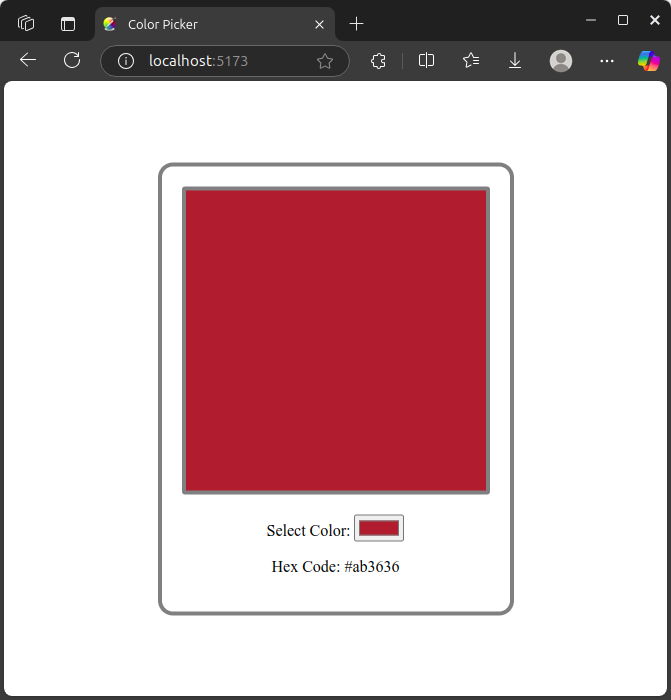

# 🎨 Color Picker Web App

A simple and interactive color picker built using **React** and **Vite**. This app allows users to select any color using a native color input, and it dynamically updates the background of a color preview box.

## 🚀 Features

- Real-time color selection with live preview
- Responsive and centered layout
- Built with modern React + Vite stack for fast development
- Clean and minimal design

## 📸 Preview

 <!-- Optional: Replace with actual image -->

## 🛠️ Tech Stack

- [React](https://reactjs.org/)
- [Vite](https://vitejs.dev/)
- CSS for styling

## 📦 Getting Started

Follow these steps to run the app locally:

### Prerequisites

- [Node.js](https://nodejs.org/) (v14 or above recommended)
- npm or yarn

### Installation

1. **Clone the repository**:
   ```bash
   git clone https://github.com/SaiAdarsh619/Color_Picker.git
   cd Color_Picker
